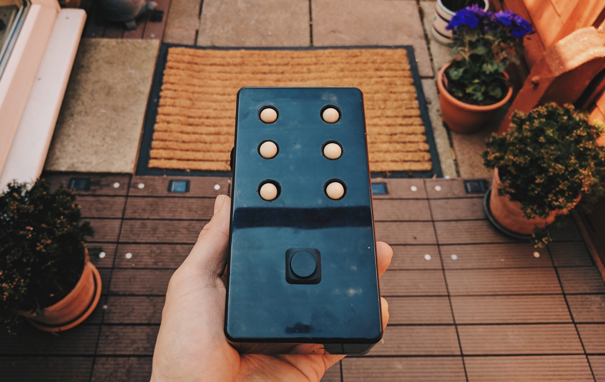
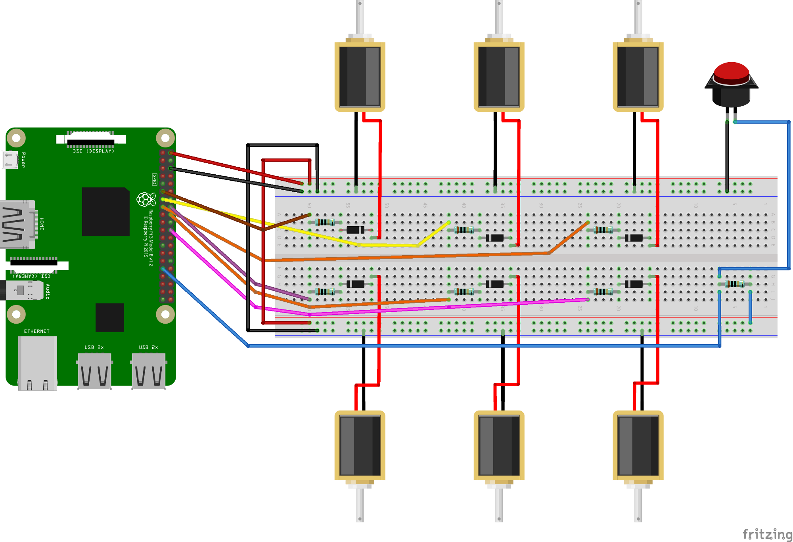

# BrailleBox

BrailleBox is a news reader for the visually impaired. 

# What it's made of

- A raspberry pi 3
- A breadboard
- A project box (mine is sized 150 x 80 x 50 — make sure your breadboard fits in here if you want it to!)
- 5v Solenoid x 6
- Wooden balls x 6 (or something similar)
- 100Ω resistor x 7
- 1N4004 diode x 6
- Push switch
- A handful of male-to-male connector cables
- Male-to-female connector cable (for connecting the GPIO pins of the raspberry pi to the breadboard) x 7 

The great thing is that this list isn’t too extensive and all of these components can be found for pretty cheap. The most expensive are the solenoids, but 5V ones can be picked up for around £2.50 each 🙂

And with the electronically components from this put together into a circuit, the schematics for the complete circuit isn’t too complex either:

